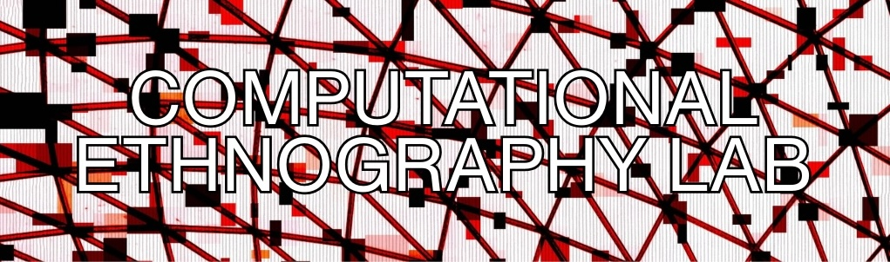
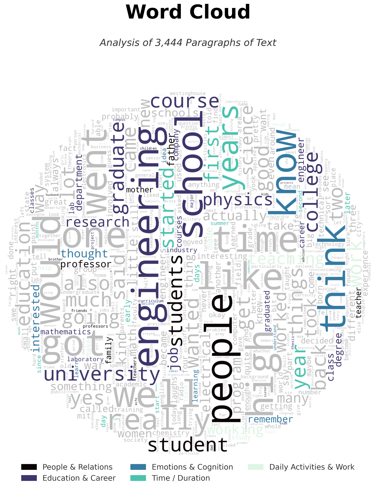

  

# The Computational Ethnography Lab (CEL) 

*Deploying and developing cutting-edge methodological techniques at the intersection of field research and computational social science to address complex problems of scientific and policy importance.* Located @ Rice University

You can download the latest vesion of the visualization toolkit [here](https://github.com/Computational-Ethnography-Lab/cmap_visualization_toolkit) 

<i>⚠️ Repository Status: This GitHub repository is currently under development. Documentation, code, and features are actively being updated/added and may be incomplete or subject to change.</i>
---

## What is Computational Ethnography?

Computational ethnography s a methodological approach that combines qualitative methods with computational social science (CSS). This involves analyzing ethnographic or qualitative data—field observations, in-depth interviews, and textual records—through both human interpretation and CSS tools for pattern analysis and visualization. This approach preserves ethnography's strengths at examining behavior and meaning in real-world contexts, while using natural language processing (NLP), machine learning (ML), and text visualization to help represent systematic patterns, test emerging typologies, and analyze larger datasets than would otherwise be possible. The method centers on human control over analytical decisions and scaling insights to advance empirical understanding, even when using automation (e.g., to help index or curate data).

Key practices include pairing structured representations of patterns (e.g., heatmaps, network plots) with in-depth narratives of behavior, using reproducible analysis pipelines, and transparent procedures that support verification. These tools were developed for broadly realist inquiry in social science and health policy, but have been used across other epistemological approaches. As a core commitment, computational ethnography extends rather than replaces human reasoning by enabling systematic analysis of larger corpora than might be feasible without computation, while preserving the contextual depth that distinguishes ethnographic work from purely computational or quantitative text analysis, addressing analytical needs between 'big data' and small-n analysis. (c.f. Abramson et al. 2018, 2026).

## The Computational Ethnography Lab (CEL)

The Computational Ethnography Lab is an interdisciplinary group developing and applying computational tools to analyze qualitative data. While affiliated scholars pursue diverse topics, our work concentrates on social inequality, health, institutions, networks, and culture. Our core commitments include building community, practicing methodological transparency, and advancing social science knowledge that serves broader public benefit.

## Principal Investigator

**Corey M. Abramson, Ph.D.**  
Associate Professor of Sociology, [Rice University](https://profiles.rice.edu/faculty/corey-m-abramson)  
Co-Director, [Center for Computational Insights on Inequality and Society (CIISR)](https://ciisr.rice.edu/)  

**Sociology**: stratification and inequality, health and medicine, culture, aging, networks, methodology (qualitative, computational and mixed methods), theory  
**Health policy**: aging, alzheimer's disease and related dementias, social determinants of health, decision making, end of life, methodology (mixed-methods, big "qual" data)  

  
  
<em>"Sunday": A photo from Professor Abramson’s fieldwork.</em>

**Books:** *The End Game: How Inequality Shapes Our Final Years* (Harvard University Press)  
*Beyond the Case* (Oxford University Press, with Neil Gong)

 
 

[Research](https://cmabramson.com/research) , [Books](https://cmabramson.com/books) , [Bio/CV](https://profiles.rice.edu/faculty/corey-m-abramson) , [Personal Webpage](https://cmabramson.com)  
  
### Key Contributors
- [**Zhuofan Li, Ph.D.**](https://liberalarts.vt.edu/departments-and-schools/department-of-sociology/faculty/zhuofan-li.html) — Assistant Professor of Sociology, Virginia Tech  
- [**Tara Prendergast, Ph.D. Candidate**](https://sociology.arizona.edu/person/tara-prendergast) — School of Sociology, University of Arizona  
- [**Victoria (Yuhan) Nian**](https://www.linkedin.com/in/yuhannian) — Undergraduate Student, Statistics/Data Science, Rice University  
- [**Jakira Silas, Graduate Student**](https://profiles.rice.edu/student/jakira-silas) — Graduate Student, Sociology, Rice University

## Selected Publications on Computational Ethnography
*In progress:* **Qualitative Research in an Era of AI: A Pragmatic Approach to Data Analysis, Workflow, and Computation.**
- Abramson, Corey M. 2024. “From Carbon Paper to Code: Crafting Sociology in an Age of AI.” *Contexts* Blog. [Link](https://contexts.org/blog/soc-ai/)
- Li, Zhuofan, and Corey M. Abramson. 2025. “Ethnography and Machine Learning: Synergies and New Directions.” Pp. 245–272 in The Oxford Handbook of the Sociology of Machine Learning, edited by C.Borch and J. P. Pardo-Guerra. Oxford: Oxford University Press.[Link](https://arxiv.org/pdf/2412.06087)  
- Abramson, Corey M., Jacqueline Joslyn, Katharine A. Rendle, Sarah B. Garrett, and Daniel Dohan. 2018. “The Promises of Computational Ethnography.” *Ethnography* 19(2):254–284. [DOI](https://doi.org/10.1177/1466138117725340)  
- Abramson, Corey M., Zhuofan Li, Tara Prendergast, and Martín Sánchez-Jankowski. 2024. “Inequality in the Origins and Experiences of Pain.” *RSF Journal of the Social Sciences* 10(5):34–65. [Open Access PDF](https://www.rsfjournal.org/content/rsfjss/10/5/34.full.pdf)  
- Li, Zhuofan, Daniel Dohan, and Corey M. Abramson. 2021. “Qualitative Coding in the Computational Era.” *Socius*. [Open Access](https://pmc.ncbi.nlm.nih.gov/articles/PMC10120879/)  
- Abramson, Corey M. and Daniel Dohan. 2015. “Beyond Text: Using Arrays to Represent and Analyze Ethnographic Data.” *Sociological Methodology* 45(1):272–319. [Open Access](https://pmc.ncbi.nlm.nih.gov/articles/PMC4730903)  

## Tools, Code & Tutorials  

### Cultural Mapping and Analysis Tools (CMAP)
- CMAP- Visualization Toolkit
*Sample Visualizations (from cmap_visualization_toolkit, using public data on Scientists Careers)*
Examples are paired with qualitative data, to show both patterns and specifics:
  
*A heatmap visualizing patterned variation in interviews*
  
*A semantic network illustrating the relationships between concepts in field notes and interviews.*
  
*A t-SNE plot.*
  
*A word-cloud, with user defined concept groups represented as color coding.*

*Data translation tool*
- in progress

### Replication Code

*Papers*
- Heatmaps:
Arteaga et al., Forthcoming,_The Gerontologist_,  [Understanding how social context shapes decisions to seek institutional care: A qualitative study of experiences of progressive cognitive decline among Latinx families. The Gerontologist.](https://github.com/Computational-Ethnography-Lab/Computational-Ethnography-Lab/blob/013a9deca633c2ec51ec0f82079d772f343388f1/reproduction/latinx_array_final.R)
- Networks: [in progress]
- Other: [in progress]

**Applied Blogs and Interactive Notebooks**:  
  - [Qualitative Coding Simplified](https://cmabramson.com/resources/f/qualitative-coding-simplified)  
  - [Sub-setting Qualitative Data for Machine Learning](https://cmabramson.com/resources/f/sub-setting-qualitative-data-for-machine-learning)  
  - [Using Machine Learning with Ethnographic Interviews (C-MAP Toolkit)](https://cmabramson.com/resources/f/using-machine-learning-with-ethnographic-interviews)  

**Video Tutorials**:
-  Set-up python environment (in progress)
-  Set-up CMAP toolkit (in progress)
-  CMAP Visualization Walkthrough (in progress)
-  CMAP Visualization advanced walkthrough (in progress)
-  Data connector walkthrough (in progress)

## Affiliations

- [Department of Sociology, Rice University](https://sociology.rice.edu/)  
- [Center for Computational Insights on Inequality and Society (CIISR)](https://ciisr.rice.edu/)  
- [Medical Cultures Lab, UCSF](https://www.cultureofmedicine.org)  
- [Center for Ethnographic Research, UC Berkeley](https://issi.berkeley.edu/cer)  

## Other Resources
- in progress
