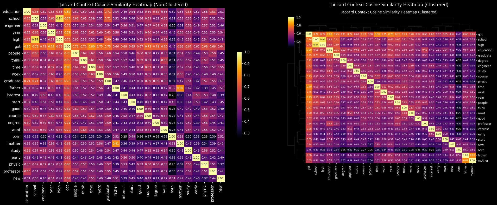
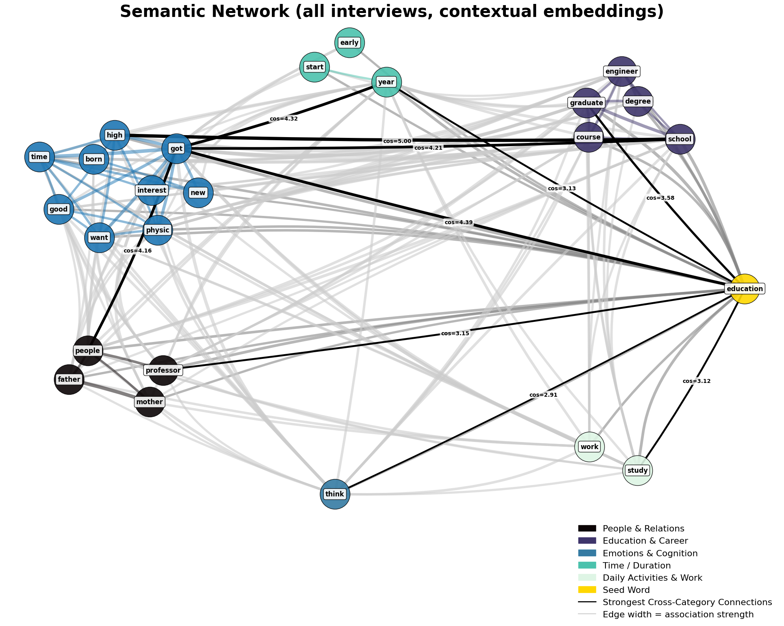

# The Computational Ethnography Lab @ Rice University

*Deploying and developing cutting-edge methodological techniques at the intersection of field research and computational social science to address complex problems of scientific and policy importance.*

---

## What is Computational Ethnography?

Computational ethnography integrates computational techniques with the analysis of in-depth human data such as field observations and interviews. This hybrid method combines ethnography’s focus on meaning, context, and lived behavior with tools like natural language processing, machine learning, and visualization to support larger samples, identify patterns, validate typologies, and increase reproducibility. These tools extend rather than replace ethnographic interpretation and can benefit projects across scientific and applied contexts when used transparently (Abramson & Dohan 2015; Abramson et al. 2018).

## The Computational Ethnography Lab (CEL)

The Computational Ethnography Lab is an interdisciplinary collective that develops and applies computational tools to analyze qualitative data. While affiliated scholars pursue a range of topics, our current work emphasizes social inequality, health, institutions, networks, and culture. Our shared values include fostering community, practicing transparency, and advancing social science in ways that generate broader public benefit.

## Principal Investigator

**Corey M. Abramson, Ph.D.**  
Associate Professor of Sociology, Rice University  
Leadership Team, [Center for Computational Insights on Inequality and Society (CIISR)](https://ciisr.rice.edu/)  

Research areas: inequality, health, and culture through ethnography, interviews, surveys, and computational methods.  
Books: *The End Game: How Inequality Shapes Our Final Years* (Harvard University Press), *Beyond the Case* (Oxford University Press, with Neil Gong).  
Projects: NIH- and PCORI-funded collaborations on cancer, chronic pain, aging, and dementia care.  

- [Rice University Profile](https://profiles.rice.edu/faculty/corey-m-abramson)  
- [Personal Webpage](https://cmabramson.com)

## Key Collaborators

- **Zhuofan Li, Ph.D.** — [Assistant Professor of Sociology, Virginia Tech](https://liberalarts.vt.edu/departments-and-schools/department-of-sociology/faculty/zhuofan-li.html)  
- **Tara Prendergast, Ph.D. Candidate** — [School of Sociology, University of Arizona](https://sociology.arizona.edu/person/tara-prendergast)  
- **Victoria (Yuhan) Nian, Undergraduate Student** — Statistics/Data Science, Rice University  

## Selected Publications & Resources

- Abramson, Corey M. 2024. “From Carbon Paper to Code: Crafting Sociology in an Age of AI.” *Contexts* Blog. [Link](https://contexts.org/blog/soc-ai/)  
- Abramson, Corey M., Jacqueline Joslyn, Katharine A. Rendle, Sarah B. Garrett, and Daniel Dohan. 2018. “The Promises of Computational Ethnography.” *Ethnography* 19(2):254–284. [DOI](https://doi.org/10.1177/1466138117725340)  
- Abramson, Corey M., Zhuofan Li, Tara Prendergast, and Martín Sánchez-Jankowski. 2024. “Inequality in the Origins and Experiences of Pain.” *RSF Journal of the Social Sciences* 10(5):34–65. [Open Access PDF](https://www.rsfjournal.org/content/rsfjss/10/5/34.full.pdf)  
- Li, Zhuofan, Daniel Dohan, and Corey M. Abramson. 2021. “Qualitative Coding in the Computational Era.” *Socius*. [Open Access](https://pmc.ncbi.nlm.nih.gov/articles/PMC10120879/)  
- Abramson, Corey M. and Daniel Dohan. 2015. “Beyond Text: Using Arrays to Represent and Analyze Ethnographic Data.” *Sociological Methodology* 45(1):272–319. [Open Access](https://pmc.ncbi.nlm.nih.gov/articles/PMC4730903)  

*In progress:* **Qualitative Research in an Era of AI: A Pragmatic Approach to Data Analysis, Workflow, and Computation.**

## Pinned Repositories & Tutorials

- **Replication Code & Data** *(to be linked when public)*  
- **Tutorials**:  
  - [Qualitative Coding Simplified](https://cmabramson.com/resources/f/qualitative-coding-simplified)  
  - [Sub-setting Qualitative Data for Machine Learning](https://cmabramson.com/resources/f/sub-setting-qualitative-data-for-machine-learning)  
- **Toolkits**:  
  - [Using Machine Learning with Ethnographic Interviews (C-MAP Toolkit)](https://cmabramson.com/resources/f/using-machine-learning-with-ethnographic-interviews)  

## Featured Visualizations

Examples from lab projects using qualitative and computational data:

  
*A heatmap visualizing patterned variation in ethnographic data.*

  
*A semantic network illustrating relationships between concepts in qualitative text.*

  
*A photo from Professor Abramson’s fieldwork.*  

> **Note:** Place the image files in an `/images/` folder in this repo.

## Affiliations

- [Department of Sociology, Rice University](https://sociology.rice.edu/)  
- [Center for Computational Insights on Inequality and Society (CIISR)](https://ciisr.rice.edu/)  
- [Medical Cultures Lab, UCSF](https://www.cultureofmedicine.org)  
- [Center for Ethnographic Research, UC Berkeley](https://issi.berkeley.edu/cer)  
