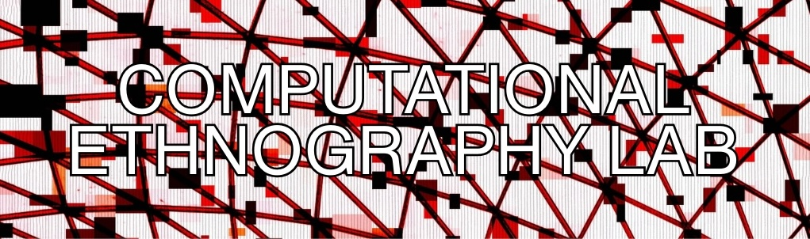
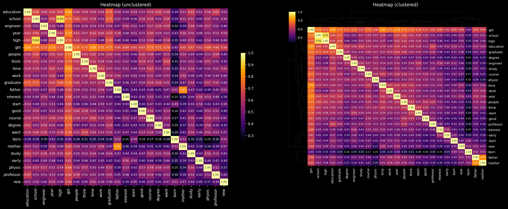

  

# The Computational Ethnography Lab (CEL) 

*Deploying and developing cutting-edge methodological techniques at the intersection of field research and computational social science to address complex problems of scientific and policy importance.* Located @ Rice University.

You can download the latest version of our CMAP* Visualization Toolkit [here](https://github.com/Computational-Ethnography-Lab/cmap_visualization_toolkit) or access an online version on [google collab](https://colab.research.google.com/drive/1n90EDMSiXhIaOULUMPJ4W4hqdZCh1NQw?usp=sharing).  
_* CMAP = Cultural Mapping and Pattern Analysis_  

<i>⚠️ Repository Status: This GitHub repository is currently under development. Documentation, code, and features are actively being updated/added and may be incomplete or subject to change.</i>

---

## Table of Contents
- [About the Lab & Our Approach](#about-the-lab--our-approach)
- [What is Computational Ethnography?](#what-is-computational-ethnography)
- [People](#people)
- [Further Reading and Resources](#further-reading-and-resources)
- [Tools, Code & Tutorials](#tools-code--tutorials)
- [FAQ](#faq)

---

## About the Lab & Our Approach 
The **Computational Ethnography Lab (CEL)** is an interdisciplinary group developing and applying computational tools to analyze qualitative data. While affiliated scholars pursue diverse topics, our work concentrates on social inequality, health, institutions, networks, and culture. Our core commitments include building community, practicing methodological transparency, and advancing social science knowledge for broader public benefit.

## What is Computational Ethnography?

Computational ethnography is a methodological approach that combines in-depth analysis of text data produced in research—such as ethnographic field notes, interview transcripts, historical documents, or web posts—with tools for pattern analysis and visualization. This approach maintains a focus on situating meaning and behavior in real-world contexts, while integrating tools from computational social science (CSS). Natural language processing (NLP), machine learning (ML), and various types of data visualization help represent patterns, test emerging typologies, facilitate comparison, and analyze individual and team-based datasets alongside in-depth human reading.

A core principle is connecting levels of analysis—much like alternating between digital maps and street views—to gain a broader vantage that may be obscured by either the scope (quantitative) or granularity (qualitative) of a single mode of inquiry. In this sense, computational ethnography extends the classical sociological strategy of using multiple methods, data types, and forms of analysis to better understand topics of importance (Du Bois 1899, 1900; Small 2011).

Computational ethnography extends rather than replaces human reasoning by linking aggregate patterns with contextual details, and by enabling the analysis of larger volumes of text than would be feasible without computation. The goal is not to remove, but to add to, the contextual depth that distinguishes ethnographic work, while enhancing the capacity to answer new questions or revisit old ones in new ways (c.f. Abramson et al. 2018, 2025). This goal overlaps with emergent scholarship at the intersection of 'scaling up' field methods and connecting “big data” to in-depth content to better understand complex issues in fields like health, culture, stratification, and social networks (Abramson and Dohan 2015; Breiger 2015; Hanson and Theis 2024; Nelson 2020; DiMaggio 2015).

## People

### Principal Investigator
**Corey M. Abramson, Ph.D.** Associate Professor of Sociology, [Rice University](https://profiles.rice.edu/faculty/corey-m-abramson)  
Co-Director, [Center for Computational Insights on Inequality and Society (CIISR)](https://ciisr.rice.edu/)  

**Sociology**: stratification and inequality, health and medicine, culture, aging, networks, methodology (qualitative, computational and mixed methods), theory  
**Health policy**: aging, alzheimer's disease and related dementias, social determinants of health, decision making, end of life, methodology (mixed-methods, big "qual" data)  

  
  
<em>"Sunday": A photo from Professor Abramson’s fieldwork.</em>

**Books:** *The End Game: How Inequality Shapes Our Final Years* (Harvard University Press)  
*Beyond the Case* (Oxford University Press, with Neil Gong)

 
 

[Research](https://cmabramson.com/research) , [Books](https://cmabramson.com/books) , [Bio/CV](https://profiles.rice.edu/faculty/corey-m-abramson) , [Personal Webpage](https://cmabramson.com)  

#### Affiliations

- [Department of Sociology, Rice University](https://sociology.rice.edu/)  
- [Center for Computational Insights on Inequality and Society (CIISR)](https://ciisr.rice.edu/)  
- [Medical Cultures Lab, UCSF](https://www.cultureofmedicine.org)  
- [Center for Ethnographic Research, UC Berkeley](https://issi.berkeley.edu/cer)  

### Key Contributors
- [**Zhuofan Li, Ph.D.**](https://liberalarts.vt.edu/departments-and-schools/department-of-sociology/faculty/zhuofan-li.html) — Assistant Professor of Sociology, Virginia Tech  
- [**Tara Prendergast, Ph.D. Candidate**](https://sociology.arizona.edu/person/tara-prendergast) — School of Sociology, University of Arizona  
- [**Victoria (Yuhan) Nian**](https://www.linkedin.com/in/yuhannian) — Undergraduate Student, Statistics/Data Science, Rice University  
- [**Jakira Silas, Graduate Student**](https://profiles.rice.edu/student/jakira-silas) — Graduate Student, Sociology, Rice University
- [**Kieran Turner, Graduate Student**](https://profiles.rice.edu/student/kieran-turner) - Graduate Student, Sociology, Rice University

## Further Reading and Resources
You can read our most recent review piece here [here](https://osf.io/preprints/socarxiv/7bsgy_v1). 

### Selected Publications on Computational Ethnography
-   *Working Paper:* **Qualitative Research in an Era of AI: A Pragmatic Approach to Data Analysis, Workflow, and Computation.** [Link](https://osf.io/preprints/socarxiv/7bsgy_v1)
-   *Blog on Uses:* Abramson, Corey M. 2024. “From Carbon Paper to Code: Crafting Sociology in an Age of AI.” *Contexts* Blog. [Link](https://contexts.org/blog/soc-ai/)
-   *Workflow*: Li, Zhuofan, and Corey M. Abramson. 2025. “Ethnography and Machine Learning: Synergies and New Directions.” Pp. 245–272 in *The Oxford Handbook of the Sociology of Machine Learning*, edited by C.Borch and J. P. Pardo-Guerra. Oxford: Oxford University Press. [Link](https://arxiv.org/pdf/2412.06087)
-   *Principles*: Abramson, Corey M., Jacqueline Joslyn, Katharine A. Rendle, Sarah B. Garrett, and Daniel Dohan. 2018. “The Promises of Computational Ethnography.” *Ethnography* 19(2):254–284. [DOI](https://doi.org/10.1177/1466138117725340)
-   *Example*: Abramson, Corey M., Zhuofan Li, Tara Prendergast, and Martín Sánchez-Jankowski. 2024. “Inequality in the Origins and Experiences of Pain.” *RSF Journal of the Social Sciences* 10(5):34–65. [Open Access PDF](https://www.rsfjournal.org/content/rsfjss/10/5/34.full.pdf)
-   *Technical*: Li, Zhuofan, Daniel Dohan, and Corey M. Abramson. 2021. “Qualitative Coding in the Computational Era.” *Socius*. [Open Access](https://pmc.ncbi.nlm.nih.gov/articles/PMC10120879/)
-   *Foundational*: Abramson, Corey M. and Daniel Dohan. 2015. “Beyond Text: Using Arrays to Represent and Analyze Ethnographic Data.” *Sociological Methodology* 45(1):272–319. [Open Access](https://pmc.ncbi.nlm.nih.gov/articles/PMC4730903)

### Citations 
- Abramson, Corey M., Jacqueline Joslyn, Katharine A. Rendle, Sarah B. Garrett, and Daniel Dohan. 2018. “The Promises of Computational Ethnography: Improving Transparency, Replicability, and Validity for Realist Approaches to Ethnographic Analysis.” Ethnography 19(2):254–84. doi:10.1177/1466138117725340.
- Abramson, Corey, Zhuofan Li, Tara Prendergast, and Daniel Dohan. 2025. “Qualitative Research in an Era of AI: A Pragmatic Approach to Data Analysis, Workflow, and Computation.” SocArXiv. September 16. doi:10.31235/osf.io/7bsgy_v1.
- Breiger, Ronald L. 2015. “Scaling Down.” Big Data & Society 83(7):42–44. doi:10.1177/2053951715602497.
- Du Bois, W. E. B. (William Edward Burghardt). 1899. The Philadelphia Negro: A Social Study. Philadelphia: University of Pennsylvania Press.
- Du Bois, W. E. B. (William Edward Burghardt). 1900. Charts and Graphs Showing the Condition of African Americans at the Turn of the Century Exhibited at the Paris Exposition Universelle in 1900. Washington, D.C.: Library of Congress, Prints & Photographs Division.
- DiMaggio, Paul. 2015. “Adapting Computational Text Analysis to Social Science (and Vice Versa).” Big Data & Society 2(2):2053951715602908. doi:10.1177/2053951715602908.
- Hanson, Kenneth R., and Nicholas Theis. 2024. “Networked Participants, Networked Meanings: Using Networks to Visualize Ethnographic Data.” Sociological Methodology 54(1):142–56. doi:10.1177/00811750231195338.
- Nelson, Laura K. 2020. “Computational Grounded Theory: A Methodological Framework.” Sociological Methods & Research 49(1):3–42. doi:10.1177/0049124117729703.
- Small, Mario Luis. 2011. “How to Conduct a Mixed Methods Study: Recent Trends in a Rapidly Growing Literature.” Annual Review of Sociology 37(1):57–86. doi:10.1146/annurev.soc.012809.102657.

## Tools, Code & Tutorials  

### Cultural Mapping and Analysis Tools (CMAP)
- CMAP- Visualization Toolkit
*Sample Visualizations (from cmap_visualization_toolkit, using public data on Scientists Careers)*
Examples are paired with qualitative data, to show both patterns and specifics:
  
*A heatmap visualizing patterned variation in interviews*
  
*A semantic network illustrating the relationships between concepts in field notes and interviews.*
  
*A t-SNE plot.*
  
*A word-cloud, with user defined concept groups represented as color coding.*

*Data translation tool*
- in progress

### Replication Code

*Papers*
- Heatmaps:
Arteaga et al., Forthcoming,_The Gerontologist_,  [Understanding how social context shapes decisions to seek institutional care: A qualitative study of experiences of progressive cognitive decline among Latinx families. The Gerontologist.](https://github.com/Computational-Ethnography-Lab/replication_code/blob/51f7ab8b3dbabedc56e470a348904a4e70216809/latinx_array_final.R)

### Teaching Resources

**Blogs and Interactive Notebooks**:  
  - [CMAP Visualization Toolkit](https://colab.research.google.com/drive/1n90EDMSiXhIaOULUMPJ4W4hqdZCh1NQw?usp=sharing)
  - [Qualitative Coding Simplified](https://cmabramson.com/resources/f/qualitative-coding-simplified)  
  - [Sub-setting Qualitative Data for Machine Learning](https://cmabramson.com/resources/f/sub-setting-qualitative-data-for-machine-learning)  
  - [Using Machine Learning with Ethnographic Interviews](https://cmabramson.com/resources/f/using-machine-learning-with-ethnographic-interviews)
  - [Introduction to Machine Learning for Coding Qualitative Research - Li et al.](https://github.com/lizhuofan95/ASA2022_Workshop)

**Video Tutorials**:
-  Set-up python environment (in progress)
-  Set-up CMAP toolkit (in progress)
-  CMAP Visualization Walkthrough (in progress)
-  CMAP Visualization advanced walkthrough (in progress)
-  Data connector walkthrough (in progress)

### Other Resources
- in progress

## FAQ
### _What is Computational Ethnography?_
See above:
- [What is Computational Ethnography?](#what-is-computational-ethnography)

### _Computers and Ethnography? Isn't that an oxymoron?_
No, not in our opinion. Because:

1. Ethnography has long encompassed varied research paradigms—including conventional science-oriented approaches to field observation, case-based alternatives that aim for complementarity, individual and team-based research, and critical as well as humanist traditions. We even published a book on how varied research paradigms-- such as the extended case method, behavioralism, phenomenologies, postmodernism, and grounded theory-- approach the ethnographic craft, including the use of computation: [Beyond the Case (Oxford, 2020)](https://global.oup.com/academic/product/beyond-the-case-9780190608491?cc=us&lang=en&#).

2. Fields including sociology have long combined multiple research methods, often with a goal of triangulation or connecting different levels of analysis. Long before modern computing or the term mixed-methods gained popularity, scholars including Du Bois used fieldwork, history, data visualization, and surveys in parallel to generate insights. In the modern era, Anthropologist Roy D’Andrade introduced heat maps to visualize linguistic domains and cognitive schema in the 1970s, ethnographers have employed social network plots to chart cliques, and scholars of culture (e.g. Bearman, Cerulo, Mohr) have been combining rich historical information with formal and computational analyses since shortly after the entry of modern computing. 

3. The use of computation was already widespread when I began my career as an undergraduate at Berkeley's [Center for Ethnographic Research](https://issi.berkeley.edu/cer/about). This is seen not only in computer-assisted qualitative data analysis software (CAQDAS- which I taught for decades), statistical computing, and the current [proliferation of AI](https://www.cultureofmedicine.org/blog/a-silicon-cage-qualitative-research-in-the-era-of-ai), but in myriad digital tools used in methods assumed to be analog (like ethnography). The contours of algorithmic/ordinal society shape our work in ways both overt and subtle. Grammar checkers and auto-complete suggestions nudge our use of language, indices of books and articles in libraries shape what we read (and how works get cited), sorting algorithms order our web searches, targeted marketing and news feeds shape our perceptions and mood during downtime, even before chatbots, automations and deepfakes. This makes [thoughtful use of qualitative computing](https://osf.io/preprints/socarxiv/7bsgy_v1), and perhaps social scientific inquiry using in-depth methods to understand life in situ, more important than ever. The challenge of navigating technology is not new however, and has some inspiring parallels in how thinkers repurposed  technologies like filing cabinets to [facilitate rigorous and imaginative social inquiry](https://contexts.org/blog/soc-ai/) in previous eras.  

### _Can I Use Your Tools If I Don’t Agree With You About Something?_
Yes. Absolutely.  

The tools were assembled based on interest and feedback over the past five years, and build on prior work in teaching and developing qualitative methodology. Many of the visualizations (heatmaps, semantic networks, wordclouds, dimensionality reduction) have been used across diverse research paradigms and use cases—academic research and community organizing, quantitative social science and computational text analysis, studies of temporality and health policy, and scientific as well as humanistic applications.  

Feel free to use and adapt. If you develop something new and useful, please consider sharing. If you have suggestions, that's great too. Regardless, we hope you find something of value.  

License information is located in the toolkit repositories. This is free software, intended to encourage collaboration and broader non-commercial use with attribution—ideally to address shared challenges rather than create barriers.  

### _Can I help?_
For any inquiries or errors, please email me at corey.abramson@rice.edu

### _Anything else?_
You can read a recent review piece about underlying principles of combining computation and qualitative analysis [here](https://osf.io/preprints/socarxiv/7bsgy_v1) and see more examples (over time). Check out [this page](https://github.com/Computational-Ethnography-Lab) over time for updates. 

You can also send an email if you have thoughts, have an example to share, or want to contribute/collaborate/comment. 
